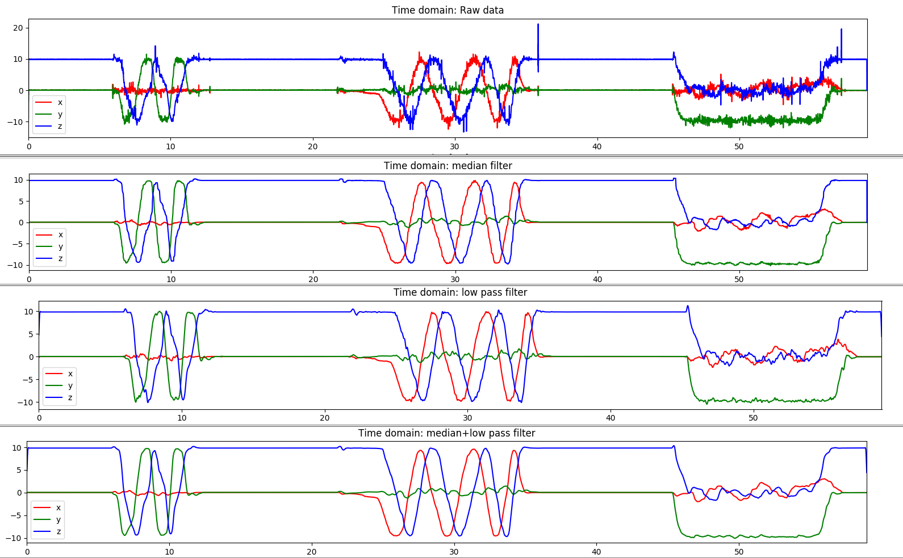
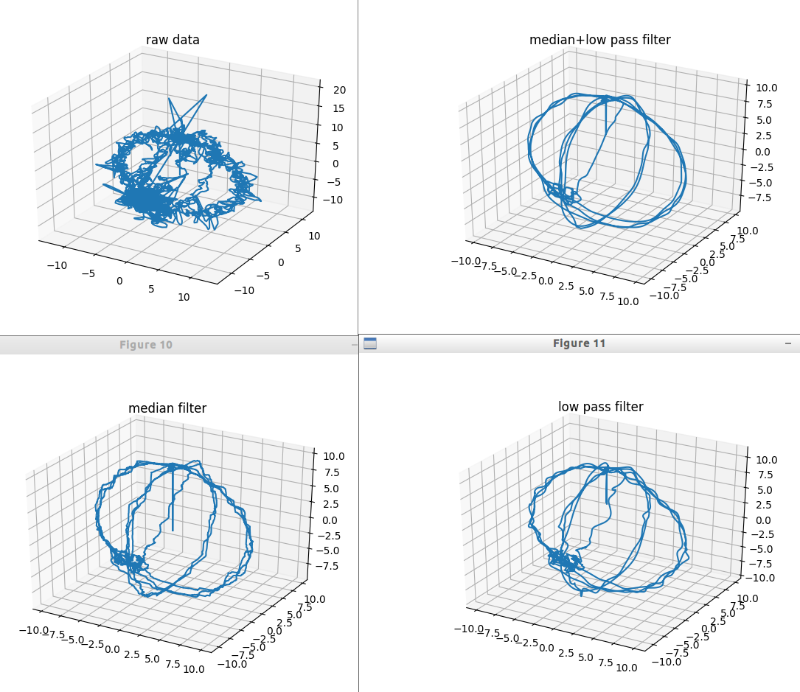

# Accelerometer data filtering
Filter 3D accelerometer data [1] with median and low pass filter. Median filter generally remove big spikes. But, high frequency noise exists at very low amplitude. Low pass filter only preserves low frequency which creates undesirable distortions. Combing median and low pass filter generally recovers a better trace (since there is no ground truth signal to verify which one is better, just follow orignal data description [1] and verify with eyes). 

Time domain comparsion. 

Accelerometer data 3D trace. 
### Dependencies
- Numpy
- Scipy
- Matplotlib

:question: However, according the original data source description [1], the above 3D trace is suppose to be the displacement which is the integration of integration of accelerometer. When I integrated the data twice, it does not show a meaningful result. :confused:  

#### More
- [x] filter data to create a clear trace
- [ ] figure out the confusion.

### Reference
[1] https://www.shimmersensing.com/support/sample-data/
